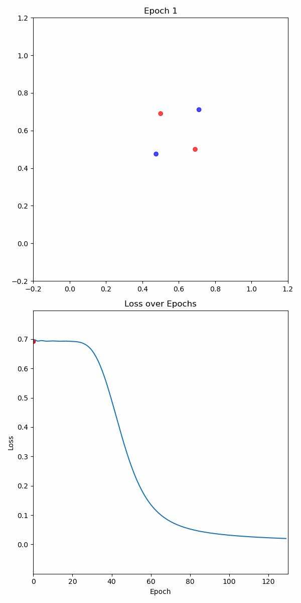

# Chapter 6: Intro to Deep Learning

## Contents

### Deep Learning as Basis Regression

[**Learning Notebook**   ](https://colab.research.google.com/github/samsung-ai-course/8th-9th-edition/blob/main/Chapter%206%20-%20Intro%20to%20Deep%20Learning/Deep%20Learning%20as%20Basis%20Regression%20-%20Learning%20Notebook.ipynb)

This notebook introduces deep learning concepts using regression as a foundation.

### Building Neural Networks from Scratch

A comprehensive series on understanding and implementing neural networks from the ground up.

[**Computational Graph & Micrograd - Learning Notebook**   ](https://colab.research.google.com/github/samsung-ai-course/8th-9th-edition/blob/main/Chapter%206%20-%20Intro%20to%20Deep%20Learning/Building%20Neural%20Networks%20from%20Scratch/Computational%20Graph%20%26%20Micrograd.ipynb)

[**Exercise 1 - Implement remaining operators**   ](https://colab.research.google.com/github/samsung-ai-course/8th-9th-edition/blob/main/Chapter%206%20-%20Intro%20to%20Deep%20Learning/Building%20Neural%20Networks%20from%20Scratch/Exercise%201%20-%20Implement%20remaining%20operators.ipynb)

[**Exercise 2 - Implement remaining backward**   ](https://colab.research.google.com/github/samsung-ai-course/8th-9th-edition/blob/main/Chapter%206%20-%20Intro%20to%20Deep%20Learning/Building%20Neural%20Networks%20from%20Scratch/Exercise%202%20-%20Implement%20remaining%20backward.ipynb)